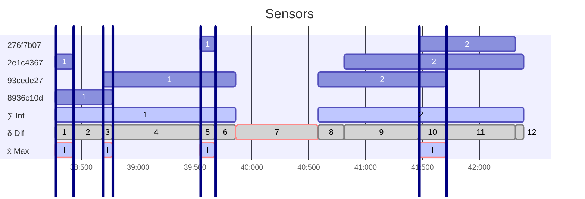

Overview
-
The library contains one simple type `DateTimeRange`, which represents an _inclusive_ interval between two points on the timeline. It has some basic features like comparison, validation, etc.
```csharp
record struct DateTimeRange
{
    public DateTime Begin { get; }
    public DateTime End { get; }
}
```

But the most valuable part is [Extensions](./Library/Extensions.cs), allowing to do things like this:


Current version supports the following methods (feel free to [request/propose/discuss](https://github.com/resnyanskiy/DateTimeRange/discussions) any other useful extensions):
```csharp
// Merges overlapping ranges in a collection of non-overlapping ranges.
// The example result is "Int" (meaning "integration") row on the diagram above.
IEnumerable<DateTimeRange> Merge(this IEnumerable<DateTimeRange> ranges)
```
```csharp
// Slices ranges into distinct adjacent ranges based on unique boundary points.
// The example result is "Dif" (meaning "differential") row on the diagram above.
IEnumerable<DateTimeRange> Slice(this IEnumerable<DateTimeRange> ranges)
```
```csharp
// Calculates all intersections between all provided ranges.
// The example result is "Max" (meaning "signals strength") row on the diagram above.
IEnumerable<DateTimeRange> Intersections(this IEnumerable<DateTimeRange> ranges)
```

<details>
<summary>Key features of the library (the LLM's "take")</summary>

- **Efficient algorithms**: Optimized for performance with large datasets.
- **LINQ-compatible**: Works seamlessly with LINQ and other .NET collections.
- **Memory efficient**: Uses iterators for lazy evaluation where possible.
- **Code quality**: The library includes comprehensive unit tests.
</details>

Example
-
Repository contains [Example](./Example/Program.cs) and [Tests](./Tests/IntersectionTests.Complex.cs), which show how to use the library.
```csharp
using DateTimeRangeLibrary;

Dictionary<DateTime, double> temperatureOutside;
Dictionary<DateTime, double> temperatureInside;

// Create ranges where temperature is above threshold
IEnumerable<DateTimeRange> hotOutside = DateTimeRange.Create(temperatureOutside, 20.0);
IEnumerable<DateTimeRange> hotInside = DateTimeRange.Create(temperatureInside, 20.0);

var hotPeriodsQuery = hotOutside.Concat(hotInside).Where(r => r.End < DateTime.MaxValue);

// Find periods when there was hot inside and outside at the same time
var maxHotPeriods = hotPeriodsQuery.Intersections();
```

NuGet Package
-
`DateTimeRange` is available on [GitHub Packages](https://github.com/users/resnyanskiy/packages/nuget/). To consume:
1. Add source `github-resnyanskiy`.
```
dotnet nuget add source "https://nuget.pkg.github.com/resnyanskiy/index.json" --name "github-resnyanskiy"
```
2. [Get](https://github.com/settings/tokens) GitHub token with `read:packages` scope for your GitHub account.
3. Set credentials for the source `github-resnyanskiy`.
```
dotnet nuget update source github-resnyanskiy --username resnyanskiy --password YOUR_TOKEN --store-password-in-clear-text
```
4. Add package `DateTimeRange` to your project.
```
dotnet package add DateTimeRange --source https://nuget.pkg.github.com/resnyanskiy/index.json
```
